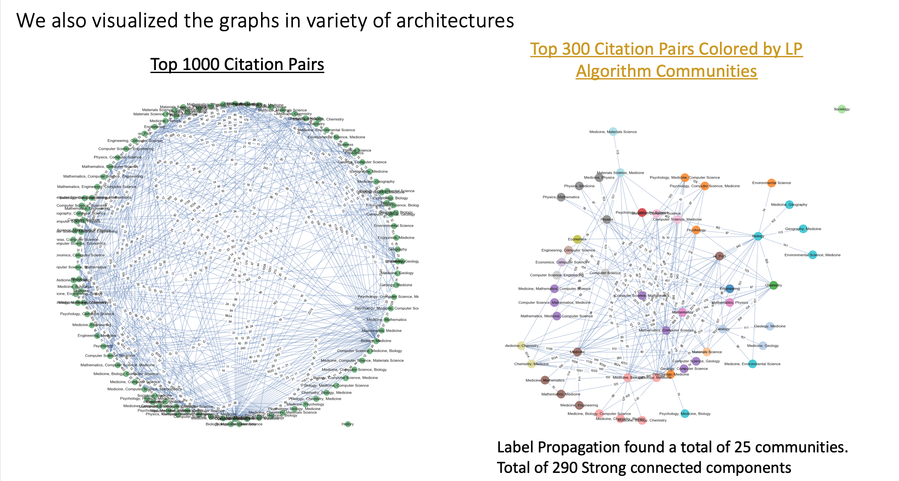

# Semantic-Scholar-PySpark

Utilizing Spark and other Big Data technologies to analyze Semantic Scholar's corpus of over ~175M research papers. Built a knowledge graph using articles as nodes and citations as edges and attempted to discover what features are important in getting cited. 

## Dataset
Datasource https://api.semanticscholar.org/corpus/

## Graphs

We built a knowledge graph of the research papers utilizing Spark Graphframes, networkx, & pyvis for visualization. The initial graph had articles as nodes and citations as edges. In order to get a more manageable graph size and a visual understanding of the connections between papers we decided to group papers by their field of study and use the number of citations as the weights of the edges.

We then applied various clustering/community building algorithms on these graphs to create clusters and understand relationships between fields of study. Below are visual representations of these communities/clusters.

## Title2Vec

We trained 50-d word embeddings on the corpus of articles and then used this embeddings as features in our models. We also created a basic semantic search function which takes an input string and returns the most similar paper title to the query within the Title2Vec embedding space. Below is a demonstration of this function:

